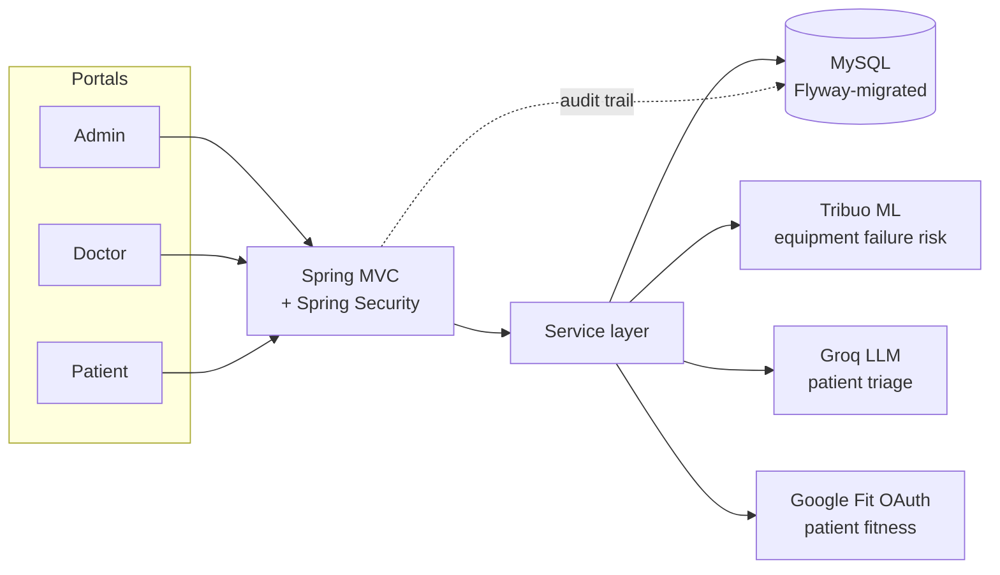

# 🏥 Hospital Resource Optimization

[](https://github.com/Rmarao/Hospital-Resource-Optimization/actions/workflows/ci.yml)
[](https://openjdk.org/projects/jdk/17/)
[](https://spring.io/projects/spring-boot)
[](LICENSE)

A Spring Boot 4 hospital management system with three portals — **Admin**,
**Doctor**, and **Patient** — that turns bed/ICU/OT scheduling, blood bank
and oxygen inventory, and patient triage into one connected app instead of
a stack of spreadsheets. An ML model predicts equipment failure risk; an
LLM reads a patient's medical history and recommends department, severity,
and resources; conflict-checked scheduling keeps two admins from
double-booking the same bed.

**No client-side JavaScript framework.** Server-rendered JSP, a small
dependency-free CSS design system, and plain `<details>`/`<summary>` where
a toggle doesn't need a round-trip.

## How it fits together



## What each portal actually does

<table>
<tr><td width="33%" valign="top">

### 🩺 Admin
- Live dashboard: occupancy bars, patient risk-distribution chart, today's schedule
- Bed / ICU / OT / oxygen / blood bank inventory
- Doctor & patient management — search + CSV export on both
- AI triage: severity score → auto-assign doctor → auto-allocate bed/ICU/OT
- Doctor weekly availability calendar
- Alerts center (low stock, expiring blood, high-risk equipment) with a live notification bell
- Audit log viewer

</td><td width="33%" valign="top">

### 👨‍⚕️ Doctor
- Assigned-patient list with live bed/ICU/OT status
- Clinical notes & prescriptions
- Book OT procedures (conflict-checked against the OT *and* their own schedule)
- Discharge their own patients from bed/ICU
- Set weekly availability
- Approve/reject appointment requests, with a notification bell for pending ones
- Profile + password editing

</td><td width="33%" valign="top">

### 🧑‍🦽 Patient
- Self-service signup, no admin needed
- Dashboard: assigned doctor, current admission, upcoming procedures
- Upcoming-care reminders banner (next procedure/follow-up/discharge)
- Request a follow-up appointment
- Printable visit/discharge summary
- Google Fit integration (steps/calories/heart-rate)
- Profile + password editing

</td></tr>
</table>

## Quick start

```bash
mysql -u root -p -e "CREATE DATABASE hospital_db"
export DB_PASSWORD=yourpassword
export APP_ENCRYPTION_KEY=$(openssl rand -base64 32)
./mvnw spring-boot:run
```

Visit `http://localhost:8080` — seeded logins: `admin@hospital.com` /
`admin123` (admin), `doctor@hospital.com` / `doctor123` (doctor), or
register a patient at `/signup`.

Full setup (all env vars, testing, CI) → **[docs/SETUP.md](docs/SETUP.md)**

## Stack

Spring Boot 4 · Spring MVC · Spring Data JPA · Spring Security · MySQL +
Flyway · Caffeine caching · JSP/JSTL views · [Tribuo](https://tribuo.org)
ML · Groq LLM API · Google Fit OAuth

## Docs

- **[docs/SETUP.md](docs/SETUP.md)** — environment variables, running locally, testing, CI
- **[docs/ARCHITECTURE.md](docs/ARCHITECTURE.md)** — project layout, how the core flows work, database migrations
- **[docs/SECURITY.md](docs/SECURITY.md)** — auth model, XSS/CSRF/rate-limiting, production data protection

## License

[MIT](LICENSE)
